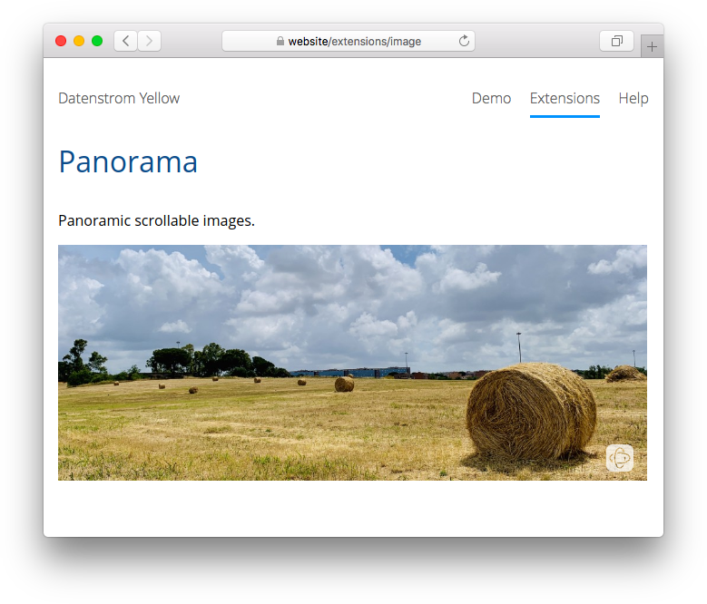

# Panorama 0.9.1

Panoramic scrollable images.

## How to install an extension

[Download ZIP file](https://github.com/GiovanniSalmeri/yellow-panorama/archive/refs/heads/main.zip) and copy it into your `system/extensions` folder. [Learn more about extensions](https://github.com/annaesvensson/yellow-update).

## How to show a panoramic image

Create a `[panorama]` shortcut. 

The following arguments are available, all but the first argument are optional:

`Name` = file name    
`Alt` = alternative text for image   
`Position` = initial position of image, from `0` to `100`

The `media/images` folder is the place to store your images. Use this extension for embedding horizontally scrollable images.  The extension is useful for images which are wider than the maximum width of the page (typically 1000px).

## Examples

Showing panoramic images:

    [panorama sunset.jpg]  
    [panorama sunset.jpg "Sunset"]  
    [panorama sunset.jpg "Sunset" 0]  

## Developer

Giovanni Salmeri. [Get help](https://datenstrom.se/yellow/help/).
